**The Simpsons** first appeared on the television screen in 1989. Today, it is the longest running animates series of all time. 

Over 600 Simpsons episodes in 30 seasons have been realeased over the past 30 years, but over the past decade the series seems to have been declining in quality. The ratings and number of viewers have both been decreasing steadily over the years.

Some say it's because of new writers, but here the goal is dig into **scripts** and the **synopsis** of each episode in order to see if any patterns can be detected that could help us understand what has happened to the series. 

Throughout this project, we looked at networks for each season of the series in order to detect changes between seasons. Each network is comprised of characters that appear in an episode's synopsis in the season and links between them. We also analyzed a script for each episode of The Simpsons for seasons 1 through 26, as well as the actual synopsis for each episode in order to see how the essence of the show has changed. 

>**An explainer notebook detailing all the procedings that went on during this project and more detailed data analysis can be found [here](link_to_notebook).**

Below, a summary of the elements that this project is comprised of can be found.

---

# 1. Data
In order to create the networks and analyze text related to the series, a lot of data needed to be collected and cleaned. 

The following table explains what datasets were used throughout the project, their attributes, size and how they were obtained. 

| Dataset             | Info                                                                                          | Originally obtained from       |Size|  |
|---------------------|-----------------------------------------------------------------------------------------------|---------------------|----|----------|
| **Episode Information** | Each episode's relevant information, such as how many viewers saw the episode, airdate, etc.  | Wikipedia       | 47KB  | [Download](data_to_download/episode_information.csv) |
| **Ratings**             | Each episode's rating                                                                         | IMDB            |  18KB  | [Download](data_to_download/ratings.csv) |
| **Demographic Ratings** | Each episode's rating for different demographics                                              | IMDB            |  77KB  | [Download](data_to_download/demographic_ratings.csv) |
| **Characters**          | Each character that has appeared in The Simpsons                                              | Simpsons.Fandom.com| 21KB | [Download](data_to_download/characters.csv) |
| **Scripts**             | A dataset comprised of the lines that appear in each episode (Seasons 1-26)                   | Data.World      |  36MB  | [Download](data_to_download/script_extended.csv) |
| **Synopsis**            | Each episode's synopsis                                                                       | Simpsons.Fandom.com| 339KB | [Download (Zipped)](data_to_download/syns.zip) |

The **Episode Information** dataset was obtained from Wikipedia with web-scraping in order to have an overview of relevant information for all the episodes of the series. This information would later be used in order to connect most of the other datasets obtained together. The dataset holds information about 662 episodes of The Simpsons, all the way back from December 17 1989 to May 12 2019. 

The **Ratings** for each episodes were obtained with the same strategy as the episode information, but now [IMDB's rating site for The Simpsons](https://www.imdb.com/search/title/?series=tt0096697&view=simple&count=250&sort=user_rating,desc&ref_=tt_eps_rhs_sm) was scraped. One rating for each episode was obtained along with the episode's name for all episodes to date. These two datasets (Episode Information and Ratings) were then combined in order to have a larger dataset that held more information. 

From this data we could immediately confirm our beliefs about the decline in quality of the series, as can be seen on the graph below.

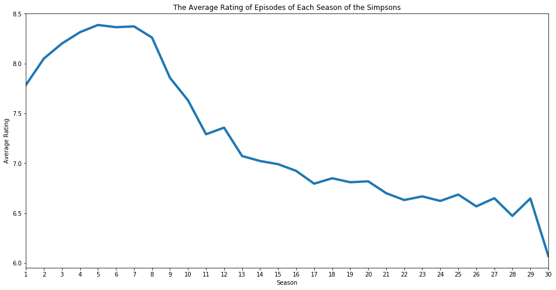

The **Demographic Ratings** for each episode were obtained in a similar manner that the **Ratings** dataframe was obtained, by scraping *IMDB*. This time, [each episodes rating site](https://www.imdb.com/title/tt0701122/ratings?ref_=tt_ov_rt) was scraped in order to obtain ratings from different age groups for both genders, namely *Males under 18*, *Males between 18 and 29*, *Males between 30 and 44*, *Males over 45*, *Females under 18*, *Females between 18 and 29*, *Females between 30 and 44*, *Females over 45*. Of course this dataset could have been a part of the **Ratings** dataset, but as the idea of scraping for demographic ratings came as the project had already progressed a bit, these dataframes were kept seperate. 

When looking at the distribution of ratings for both genders, it can be seen that males tend to rate the series higher than females do, and males give more ratings.

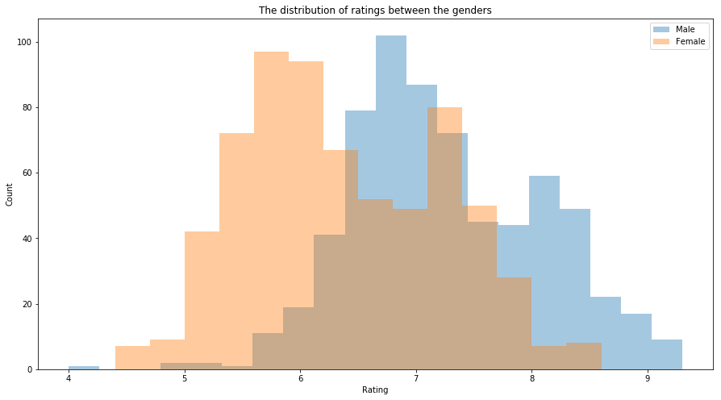

However, as the series has progressed, female ratings have not declined as much as the male ratings. In the beginning females did not like the show as much as males, but today their average ratings is approximately the same.

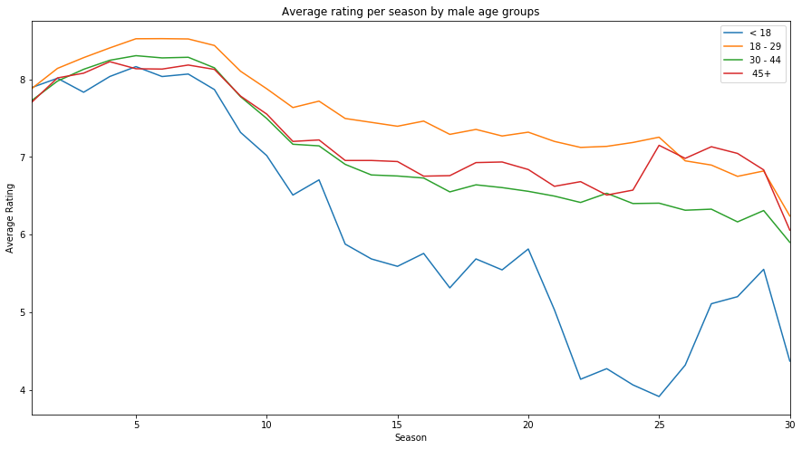

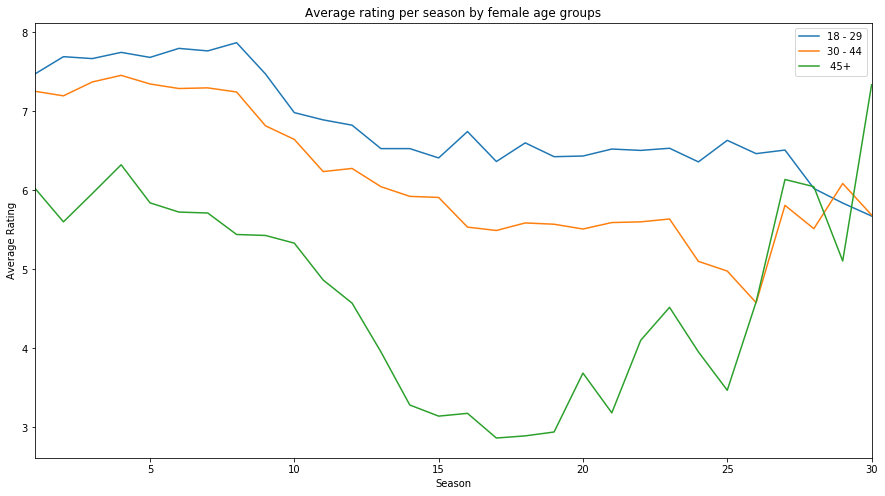

It seems that the series has started to appeal less and less to young males and more and more to older females, according to these graphs. However, as males rating amounts have dominated the female ones over the years, the series still sees its ratings go down. 

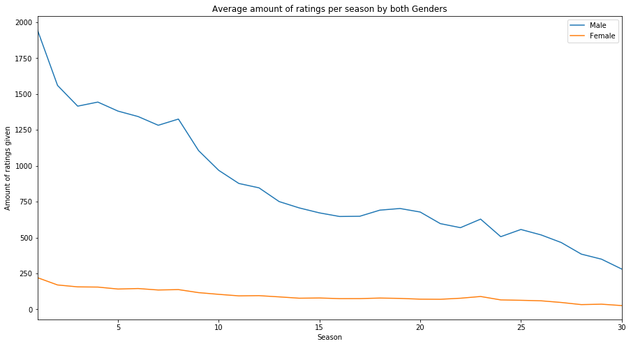

The **Characters** dataframe was obtained from [Simpsons.Fandom](https://simpsons.fandom.com/wiki/Category:Characters) Wiki page. All the names of every character that has appeared in the series was scraped along with their relevant Simpsons.Fandom Wiki link, which was used later in order to determine which characters appear in each episode. A total of 556 distinct characters ended up in the dataframe. 

A lot of cleaning had to be done because some characters were not relevant to our analysis. 

A dataset holding the **Script** for each episode was hard to come by. The dataset that was used was found on [Data.Word](https://data.world/data-society/the-simpsons-by-the-data/workspace/file?filename=simpsons_script_lines.csv). 

In order to obtain the **Synopsis**, [Simpsons.Fandom](https://simpsons.fandom.com/wiki/List_of_Episodes) was again scraped, but this time each episode's page was scraped in order to obtain the synopsis for each and every episode in *HTML* format.

An example of a synopsis which was scraped can be seen below: 

`
Thanks to a radio talk show host, <a class="mw-redirect" href="/wiki/Mayor_Quimby" title="Mayor Quimby">Mayor Quimby</a> is pressured into releasing <a class="mw-redirect" href="/wiki/Sideshow_Bob" title="Sideshow Bob">Sideshow Bob</a> from prison. Once out, Bob promptly runs against the mayor and wins. <a class="mw-redirect" href="/wiki/Bart" title="Bart">Bart</a> and <a class="mw-redirect" href="/wiki/Lisa" title="Lisa">Lisa</a> set out to prove Mayor Bob did not legally win.

`

The hyperlinks (``) that are in the synopsis denote which characters wikipedia page is in the episode, and those characters are considered to be the main characters of an episode, which will be used for building the networks.

---
# 2. The Networks

***IMPORTANT NOTE:***

> The reader is encouraged to visit a special site dedicated to the networks that were created as a part of this project and play around with them. This website can be found [***here***](https://audurannaj.github.io/the-simpsons/networks.html). 
There the reader can also see the centrality measures for each and every character for each and every season!

A network was created for each season of The Simpsons. A node in the network represents a character that has appeared in a **synopsis** of an episode in the season, and a link between nodes is created if two characters appeared in a synopsis **of the same episode** in the season. 

The size of each node is dependant on **how many times the character appeared in a synopsis** - the more often, the bigger the node and if the character is a main character in an episode within the season, the node gets a *weight boost*. 

The width of each edge is dependant on **how many times two characters appeared together in a synopsis** - the more often, the wider the edge. 

When visualizing the networks, there were no dramatic changes to them through the seasons except for, of course, new characters (nodes) and some different edges introduced. The largest nodes almost always seemed to be **Homer** and **Bart**, with the *center of gravity* of the node, i.e. where the strongest links are, being around The Simpson family. However, when visualizing the three best rated seasons vs. the three worst rated seasons, there seemed to be an apparent contrast in the number of nodes and links in the networks. The highest rated networks seem to consist of much more characters than the lowest rated networks. 

**The three highest rated seasons visualized as networks:**

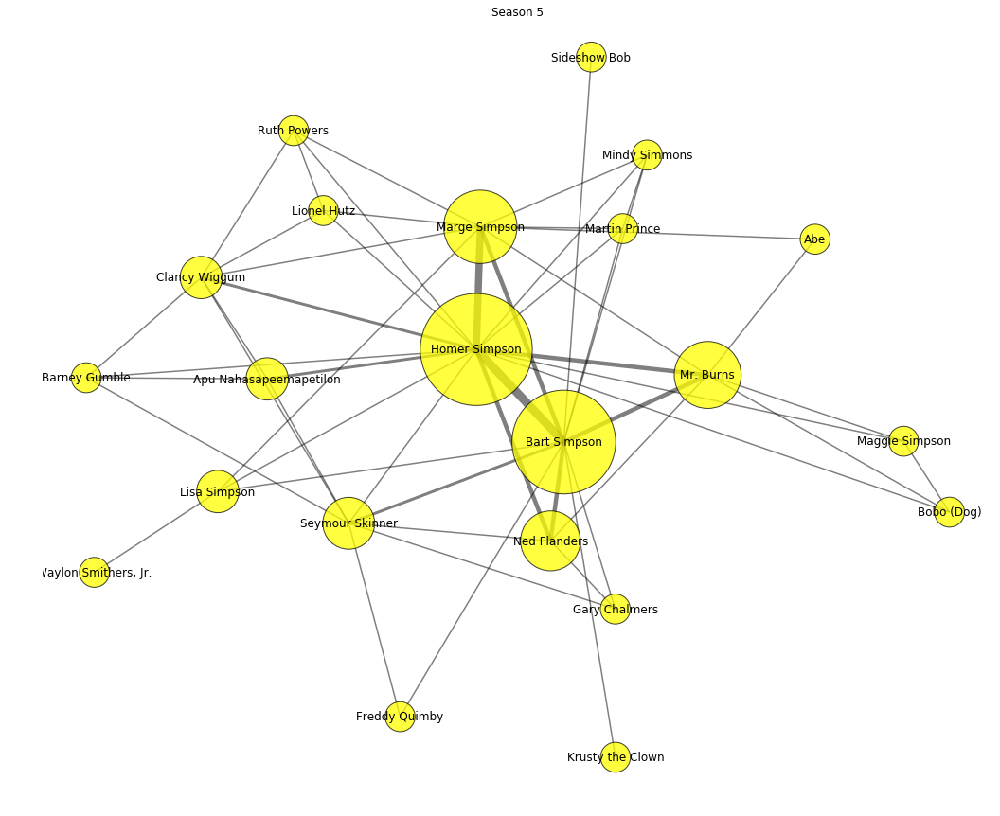

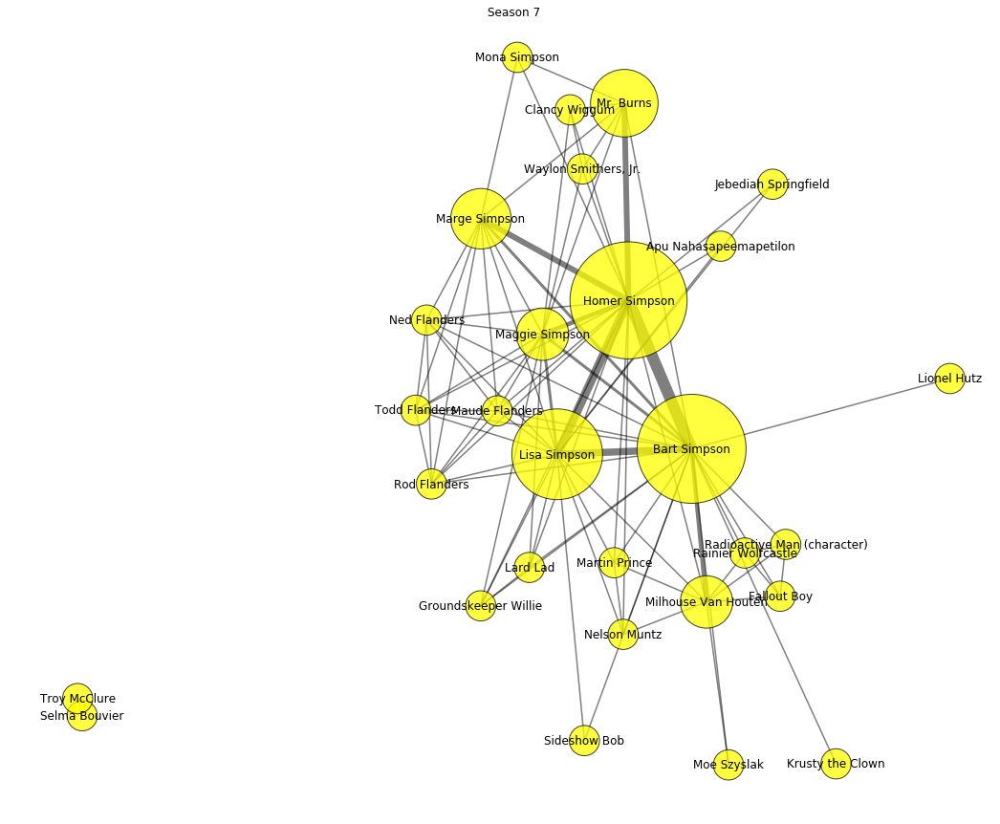

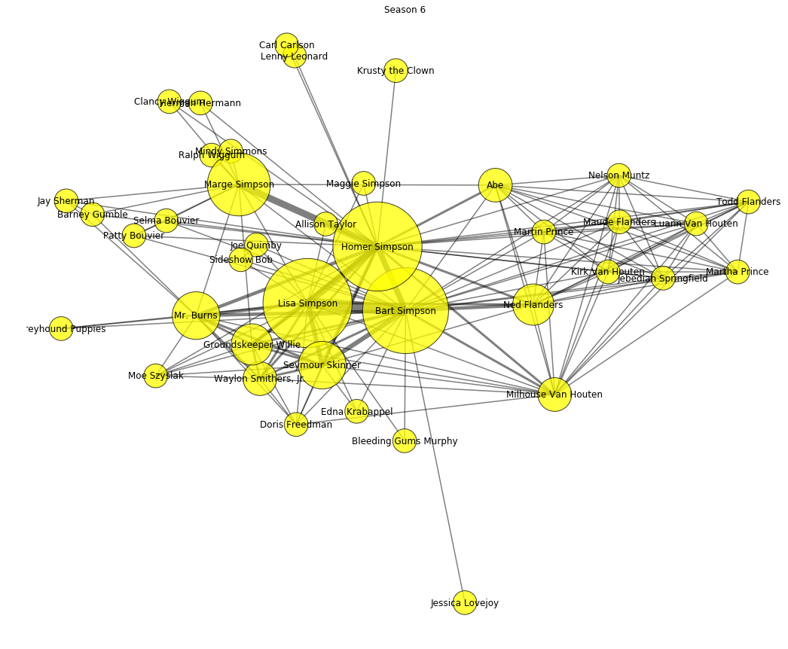

**The three lowest rated seasons visualized as networks:**

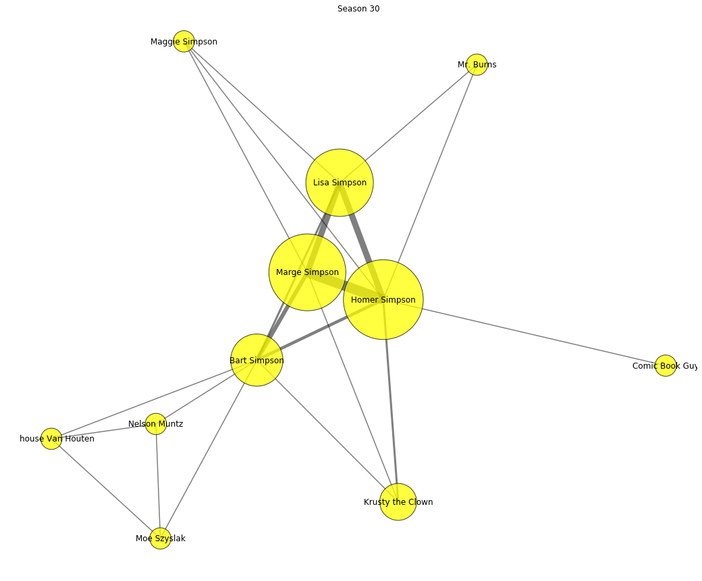

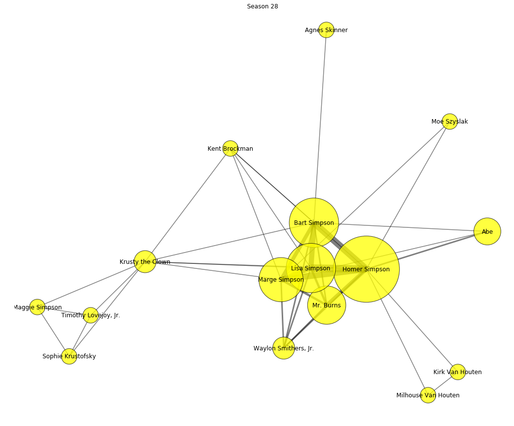

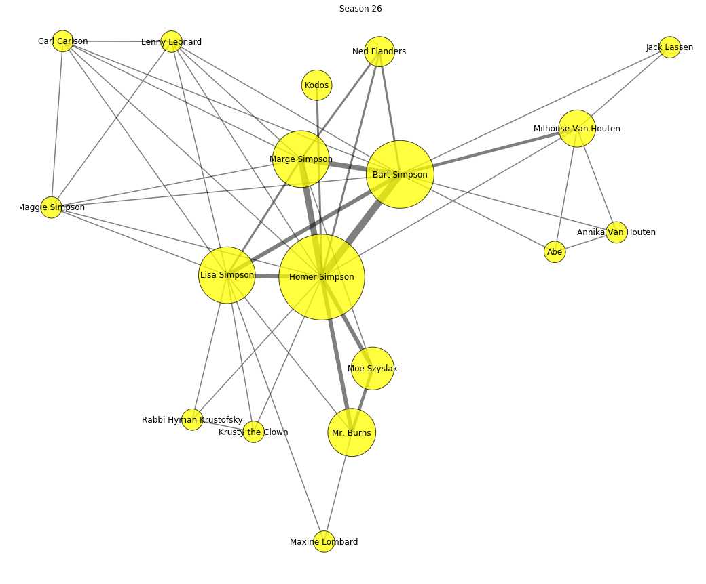

When the centrality measures of these networks were analyzed, the importance of the female family members, i.e. **Marge** and **Lisa** seemed to be getting larger and larger as the seasons went by. Three centrality measures were calculated for every node of every season, and the regression of those measures were visualized for the four main characters (see below). 

**Degree Centrality for each family member over the 30 seasons:**

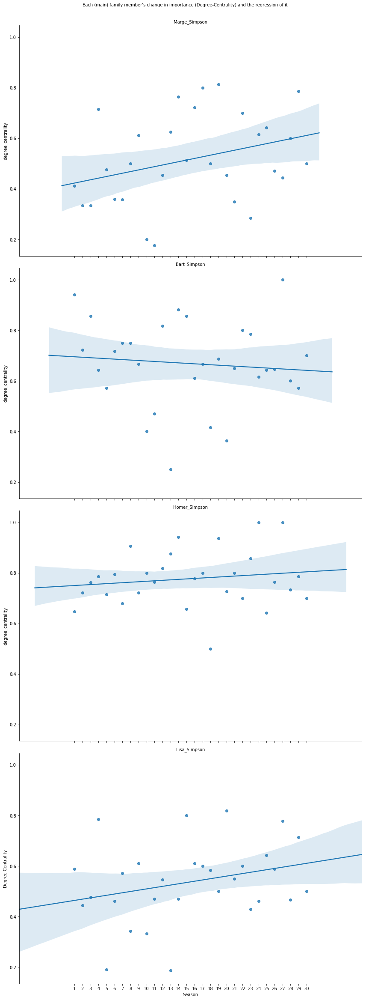

**Betweenness Centrality for each family member over the 30 seasons:**

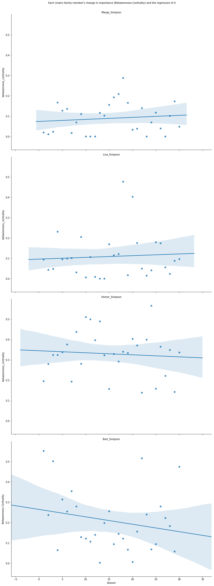

**Eigenvector Centrality for each family member over the 30 seasons:**

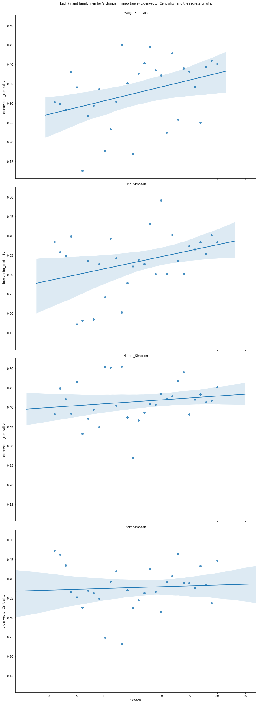

In all of these measures, the two female family members' influence in regards to these centrality measure is growing while the men's influence is either declining or staying even (**Maggie Simpson** is exluded in these graphs because she does not appear in many synopsis and is really not a relevant character in the series).

This is also the case when visualizing the change in the size of each family member's node size over the seasons, with **Marge** and **Lisa** growing in size while **Homer** and **Bart** do not show as much growth but do stay quite large. 

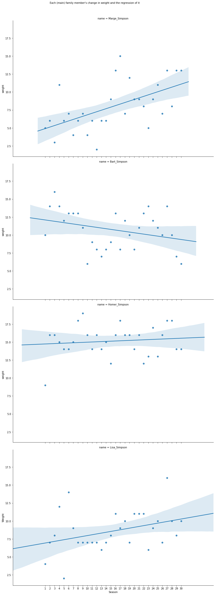

The growth of the appearances and influence of the female family members of The Simpson family could explain why ratings have been going down, i.e. why men seem to be distancing themselves from the series. As has been discussed, men's ratings have declined and as they are the majority of the votes that have been given over the past years, their opinion is the reason behind the decline in popularity of the show. 

The series seems to have lost its appeal it had to men and started appealing more to women, according to the demographic ratings. This could be the cause of more episodes featuring **Marge** and **Lisa**, with **Homer** and **Bart** taking a small step back in their dominance over the series. The analysis that was carried out on the networks created does seem to tell a story of these female characters gaining more and more influence in the series, with the two previously dominant male characters having to share the spotlight. 

***LIMITATIONS:***

> These networks are created from the synopsis for each episode of a season. These synopsis sometimes create links between characters which do not represent their interaction within the episode, i.e. if there are subplots (A-plot and B-plot) for an episode, those that appear together in the A-plot (the main plot of the episode) are linked with those that appear in the B-plot (the subplot of an episode) maybe without them actually interacting together in the episode. 

---

# 3. Show's Topics

***IMPORTANT NOTE:***

> The reader is encouraged to visit a special page dedicated to show every WordCloud created and confront them. This page can be found [***here***](https://audurannaj.github.io/the-simpsons/wordclouds.html). Note that scripts WordClouds are available just until season 26, because of the availability in the dataset

To understand the evolution of the show it is important to take a look at the distinghuishing topics treated in every season and wether these topics are appreciated or not by the viewers.

To do that **TF-IDF** score has been used: it combines how many times a word appears in a document (Term Frequency) and how rare that word is in regards to it appearance in the compared documents (Inverse Document Frequency). The result is a score for every word in each document, indicating how important that word is in distinguishing that document from the others. This information has then been used to produce **WordClouds** (images containing words that have a size proportional to their score) and barplots.

Confronting a lot of wordclouds was prohibitive and messy, because of the huge number of words and how different these words are. To make this manageable while keeping it relevant, seven distinct seasons have been analyzed (but each one contributes to the score computation):

* **Top 2 seasons in the first 9**. These are considered the best seasons in the show's history. The ones with the best ranking will be used to be as accurate as possible in the analysis. The resulting seasons are the 5th and the 7th respectively.
* **Worst 2 seasons after the 17th**. This because the rating decay gets slower after the 17th season. These seasons can give insight on the cause. The resulting seasons are the 26th and the 24th respectively.
* **Seasons 11, 12, 13**. What is that brought the show from such a high rating to a pretty low one? These seasons, which are in the middle of the rating decay, were analyzed: the choice has fallen on these because it happens that season 12 improves the rating of the previous season, just to fall down again with the 13th. This has then to be a focal point for the analysis. 

Some preliminary observations are:
* It was not easy to see patterns either in the WordClouds or in the barplots: research on the words was required in order to delve deeper into the topics. To learn more about that, see the explainer notebook linked at the top of this page.
* The show in general does evolve following the real world, following the main topics and the common view on them.

## 3.1 Synopsis Topics

The first analysis was on the synopsis extracted. A lot of themes and considerations emerged here: the further analysis done on the scripts confirms and expands the findings.

There are a lot of **political** and **ethical** topics, but they seem to be more and more frequent later on in the show: this may arise the suspicion that the show went from representing a parody of a typical american family to educate people on the current relevant hot topics. This might have been seen by fans as a forced introduction into the show, changing its nature and so lowering its value. Another possible explanation is just that the few political topics in the first seasons were presented in a different and in a way that better suited the interest of the audience.

One of the biggest topics is **environment**: it is always present, but after season 10 it presents with more insistence. Looks like the viewers are not liking a lot these issues, probably because they feel like it's a distant problem: vice-versa immigration seems to affect them in a more direct way and it is more interesting to them. This, though, is in contrast with season 5 that exposes the safeguard of animals problem: maybe animated beings have more value to people than plants, or maybe that season was simply very appreciated that this topic didn't affect it too much.

There is also the need to confront this with the audience graphs. Both male adults and teens ratings did decrease a lot during the years. This happens for the female audience as well, but more aged women (45+) do give higher scores to some of the lastest seasons. This is probably because of the introduction of more appealing topics for them: an example is explained in the next observation. Still the number of these viewers is not enough to stop the drop of the rating.

In the figure below it can be seen how **political**, **environmental** and **feminists** topics are combined and distinghuish in particular in season 26: the event is that nigerian princess (her name is Kemi) is given a big role, coming to Springfield to close a deal for uranium with Mr. Burns.

	

## 3.2 Scripts Topics

By analyzing all the Simpsons scripts, the previous observations on the synopsis have been confirmed and new topics have been found.

The **environment** really is a very discussed topic in the Simpsons' show (which was expected given the nature of Lisa's character). Still, looks like it is handled differently by the "declining" season from the first ones. It seems too pervasive and that could have annoyed the audience.

The **military** is a new topic found and it seems to be a well perceived and important argument to the audience, even if not very common and present in few episodes: this can be understood by looking at how much americans feel the importance of having a respected army. Along with this Granpa Abe seems to gain a more relevance as the seasons go on, to the point of having some episodes focused on him. This, on the contrary with the military topic, has not brought a lot of interest in the show, because it is more pervasive in more negative seasons: it is present more and more in the lastest ones and the audience may perceive having the focus this much on an old character and flashbacks as boring or not too interesting.

**Political** themes seem to be not as evident as in the synopsis analysis, but some **ethic** is put into environmental topics, perceived in different ways depending on how they were presented: looks like the presentations in the first part of the show were more enjoyable for the public. Also a **religious** topic is exposed, but it is likely not really appreciated as it appears in one of the worst seasons.

Overall the analysis of the scripts pretty much confirmed and expanded what was inferred in the synopsis analysis, strenghtening the observations on the environment topic, adding the military, and confirming the presence of musical and artistic themes in well perceived seasons.

Again the WordCloud example is about season 26: it still shows environmental issues (**fracking** is a technique to expoit resources hidden in the terrain that can be dangerous if not done porperly and a deep study of the land), but also depicts how the show adapts to the current times, by bringin in the innovator **Elon Musk**. 

	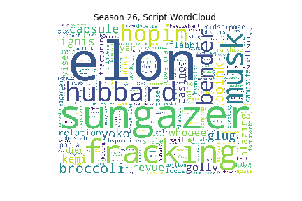

## 3.3 Main Characters 

Another big point in the text analysis is to compute the TF-IDF on the characters, to see how they changed during the seasons. To be compliant with the above analysis only season 5, 7, 11, 12, 13, 24, 26 have been analyzed.

To do this with all the characters would be again messy and prohibitive, so the most speaking characters have been chosen: as expected, these characters are by far the Simpson family and thus their evolution has been studied.

The characters of the family have not changed their personalities a lot during the seasons, but the two female characters got more space during the years.

Now each character is presented independently. To show each one's analysis click on their names.

 
Homer Simpson

The first thing that was noticed is that a lot of Homer's top-scoring words match the main themes of the respective season. This is logical also thinking that Homer is one of the main characters and the most speaking one and thus contributes a lot to the finding of the themes in the previous iterations of the analysis. Thus his themes pretty much change along with the show's ones.

There is no real comparison one could do in this case of the different language Homes uses. It is then how important or frivolus the topics he talks about are. Among the seasons the words he uses are mostly pretty short, which usually reflects on the words to be common and easy, while long and elaborate words are more complex. This usage suites Homer's character since he is supposed to be simple-minded.

Overall it can be said the data has no real evidence to say Homer's behaviours changed a lot during time. Still, judging by the matches with the most relevant themes emerged from the TF-IDF scripts analysis it can be seen how his role gets a bit less central as the seasons go on, so he cannot be too much responsible for the decline of the show.

In the below figures there is a demonstration on how central Homer still is in season 11 (even though it is a declining season): we can identify a lot of episodes just by looking at his top words: **Mel Gibson**, **tomacco**, **burglar** and so on.

	 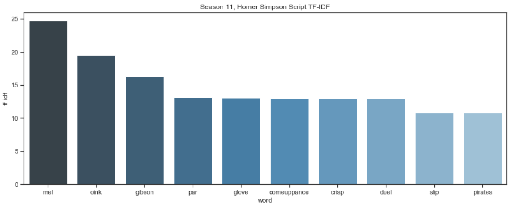

 
Marge Simpson

It can be stated that Marge stands out a bit from her mother role after the first seasons, being envolved more with the action, but at the end she doesn't seem too central in distinguishing topics of the seasons. Still her character and characterization seems stronger in the last seasons, even though she has always been a strong woman.

From the analysis looks like her role as a mother also becomes more central in the action and more dynamic, not just remaining in the house, but even acting in first person to protect her children.

This importance growth seem to not have been perceived well by the audience: the raise of Marge happens during the worst seasons. It seems like the public preferred Marge to stay more in a classical mother role.

The following figures show how she passed from just "meaningless" words to identify the context like **ya** and **blah** and a very stereotypical word for women like **necklace** to more important meanings, like **guardians**, **educational** and **parenting**, not just doing the mother but putting in discussion her role.

	 

 
Bart Simpson

While with Marge it cannot be seen a big involvement into action, with Bart, with big themes at first and still a lot of important appearences during the decline, it can be stated that there's a lot of action going on, he always putting himself into troubles or putting other people into trouble as well.

For what concerns the character Bart is still a boy and so he is staying true to his rebel character, even though in the declining seasons there has been some personal growth in him (for example he is generous in season 13). The biggest growing is evident in season 24, where he has interest into girls. Since the ratings have been going down it might be that the first natural Bart character was the most liked by the public.

Also it is interesting to notice how until this point the male family members have still a predominant role wrt to Marge.

The growth is depicted in the WordClouds of seasons 13 and 24. In the first one we have Bart still following an idol of him, **Buck McCoy**, an actor interpreting a **cowboy**, and **tabooger** and **stanford**, the first referring to a prank and the second word referring to a way of mocking Lisa. In the second one instead, we can see his interest into **girlfriends** (and more specifically one named **Zenhya**).

	 

	
Lisa Simpson

Looks like Lisa's character is more constantly into the main action than his mother, but there is definetly a rise of her role in the lastest seasons. Her interests remain pretty much the same during the seasons, same as her character, but from season to season there is one that stands out.

In season 11, which is a very declining one she has big roles and her character is expanded even more: this complies with the rise of female and a bit of decline of male characters, which seems connected with the declining of the show. It is a big unexpected, though, that she has big roles in season 12, where the rating was going a bit up again.

There are big themes that can be linked with Lisa: environment, arts, knowledge. The most prominent in the show is environment and that's probably why Lisa, being sensible with it, still has big roles throughout all the seasons. This very well complies with her character, pretty self evident even just by watching a couple of episodes.

Season 12 is a bit of atypical season, inverting the negative trend, but having Lisa covering big roles. In the figure a lot of words connected to the main themes typical of Lisa can be seen: **chimps** (animals that the family has to save), **subliminal** (a subliminal message by Bart and Lisa feels she has to discover the meaning: that is her curiosity), **linguo** (a grammar robot she has built with her knowledge and study).

	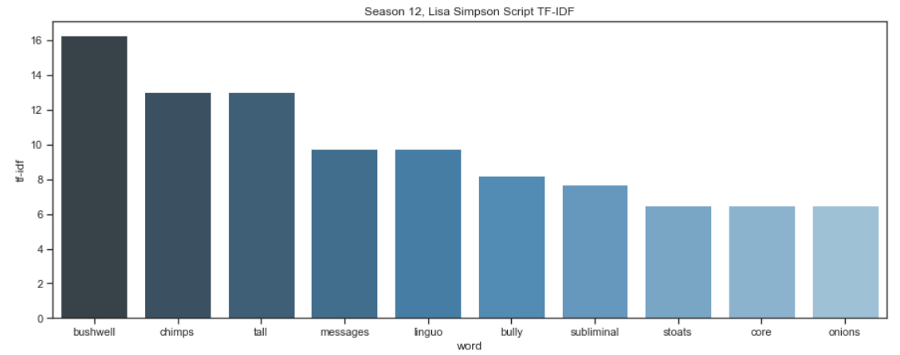

---

# 4. Sentimental Analysis

Here the goal is to show how the sentiment score of the seasons have changed through the 30 years of production and put it into perspective with the decreasing ratings and views. Sentimental Analysis aims to measure the happiness in text on a 9-point scale. The higher the score, the more happiness in the text.

In order to rate the sentiment of words, a datafile with 10,222 words and their happiness score was used, see [here](https://journals.plos.org/plosone/article?id=10.1371/journal.pone.0026752). The sentiment scores were calculated as the average of sentiment scores for the text considered. If a word did not have a sentiment score it was disregarded from the calculation.

Sentimental Analysis was carried out on the spoken words from the scripts. Here the main findings will be presented.

## 4.1 Developement Through Seasons
The average sentiment score of each seasons spoken lines can be seen in figures below. Even though the change in sentiment score only ranges from 5.42 to 5.47 it can be seen that there is an **upwards trend over the seasons**. 

Looking at how the sentiment score has developed compared to ratings, it can be seen that over the first 9 seasons the ratings are going up while the sentiment score has a downwards trend. This then changes from season 10-15 where the ratings start to drop significanly while the sentiment score grows. Then through seasons 16-26 the sentiment score is pretty steady while the ratings have a small downwards trend. 

The **correlation between the ratings and sentiment score is -0.5** which confirms that there is a negative relationship between the two variables. 

These findings hint that there **increasing happiness of the seasons could be a factor in the declinging ratings**, and indicates that the viewers like dark humor.

Another interesting point is that the number of words spoken are decreasing throughout the seasons. When comparing the 1st and the 26th season it can be seen that the **number of words spoken on average in an episode has decresed about 20%**.

<!---

--->

## 4.2 Developement of Characters 
Here the top 20 speaking characters were considered and their sentimental scores. Out of the 20 top speaking characters only 3 are females, **Marge**, **Lisa** and **Edna**, so male characters are more visible in the show. The figure below shows the number of words spoken on average in a season and the standard deviation. **The Simpsons family play the the main role in the series**, where **Homer** much more speaks than other characters. 

And how does the **number of words spoken develope through the seasons?** The figure below shows how the porportion of the total number of words spoken for each season for the top four characters develope. **Homer** and **Bart** are speaking less as the seasons go by while **Marge** and **Lisa** are speaking more.

When looking at the mean and standard deviation of the sentiment scores for the top 20 character it can be seen that there is not a big variation in the mean senitment scores. It is interesting to see how **the characters seem to speek almost equally happy words on average.**

Since the Simpsons family play a major role and **speak 68% of the total number of words spoken** we will only present the sentiment analysis for those characters. By fitting a regression to their sentiment scores throughout the seasons it can be seen that they all have an **small upwards trend.** **Homer and Bart have a bigger upwards trend** than **Lisa and Marge but they have a higher sentiment score on average.**

# 5. Findings
It can be seen that by looking into the synopsis and the scripts there are some changes throughout the seasons that could explain why the ratings and the number of viewers have been declining. The main findings are:

- When looking at the **sentiment scores of spoken words** in the seasons it can be seen that it has a **small upwards trend**. It also has a correlation of -0.48 to the ratings, which tells us that while the sentiment score has been going up the ratings have been going down. 
- The number of **words spoken on average per episode in a season has been falling** almost since the start. The average number of words spoken in an episode in season 1 was 1527 vs. 1289 in season 26. 
- When looking at the sentiment scores of each character it can be seen that the members of **the Simpsons family are getting slightly happier** in regards to spoken words. Five of the top 20 speaking characters have a noticable high upwards trend: **Milhouse Can Houten**, **Nelson Muntz**, **Lenny Leonard**, **Carl Carlsson** and **Julius Hibbert**.
- **Merge** and **Lisa** have a higher sentiment score on average than **Homer** and **Bart**.
- **Merge** and **Lisa** are gaining a more important role in the series according to all centrality measures of the network, while the importance of **Homer** and **Bart** is declining. 

The results of the demographic analysis were that **men are the vast majority of the raters** and the main age group that is rating the series is people from 30-44 for both genders. When looking at the ratings in respect to gender it can be seen that the **fall in the ratings is not as big for the female audience as the male audience**. 

From the findings it could be suggested that the viewers respond better to more sad episodes, where many words are spoken and where **Bart** and **Homer** play a big role. When linking thoses results to the fact that the ratings for women audience have not fallen as much as for the male audience, this hints that women have different prefrences than men in regards to the tv-show.

Even though the findings suggests some factors that could affect the ratings of the Simpsons, **these factors are not likely explain all the decines in ratings**. Even though the spoken words and the synopsis tell alot about the content of the show, the environment, circumstances, how things are said also affect how people relate to the characters and the show.

---
